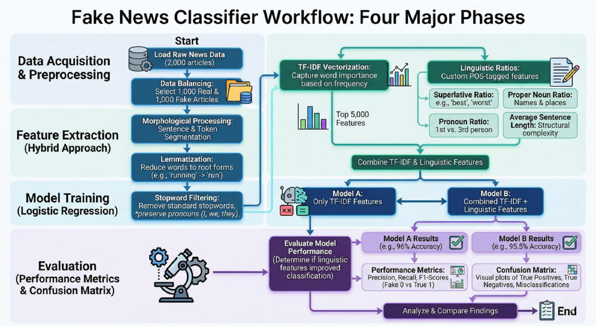
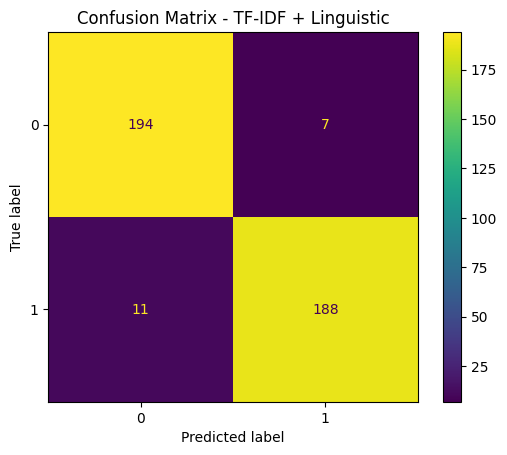
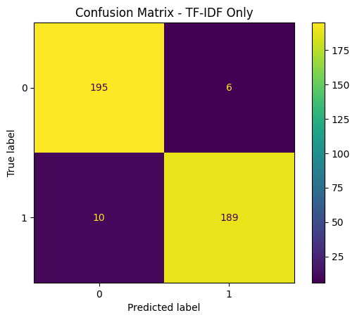
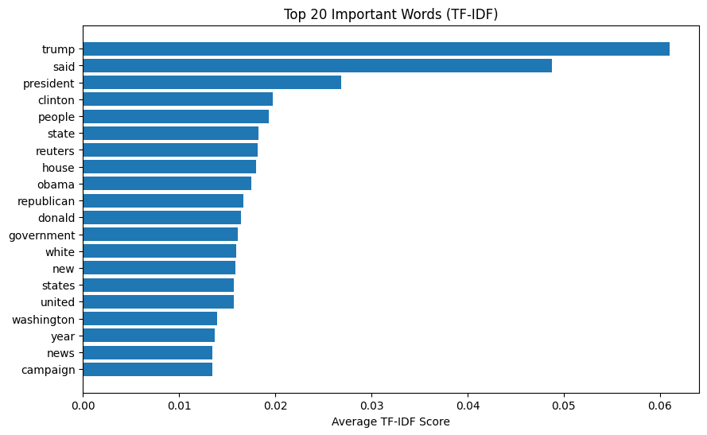
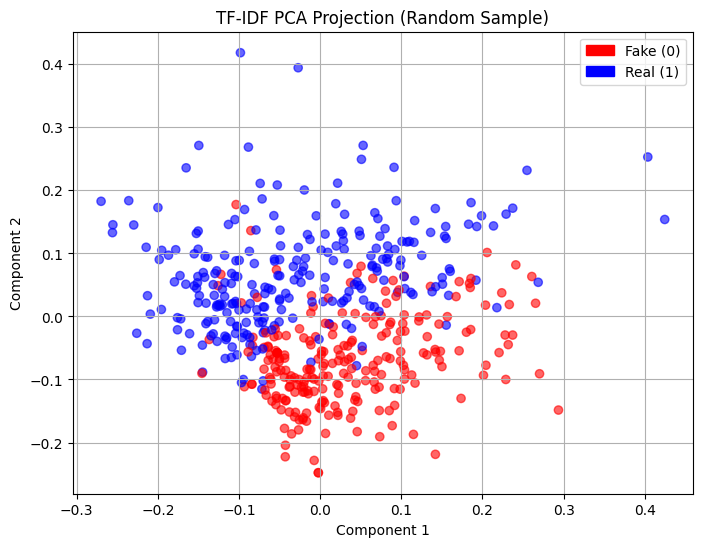

# Fake News Classification using TF-IDF and Linguistic Feature Analysis

## 📌 Project Overview

This project focuses on detecting fake news articles using Natural Language Processing (NLP) and Machine Learning techniques. The classifier analyzes both lexical patterns and linguistic writing styles to classify news articles as:

- Reliable (Real News)
- Unreliable (Fake News)

The project combines:
- TF-IDF Vectorization
- Linguistic Feature Engineering
- Syntax Analysis
- Logistic Regression Classification

---

## 🎯 Objectives

- Build a machine learning model for fake news detection
- Extract linguistic features such as pronouns, superlatives, and adjectives
- Analyze syntactic complexity using sentence structure and tree depth
- Compare TF-IDF-only vs TF-IDF + Linguistic feature models
- Visualize feature distributions using PCA and TF-IDF plots

---

## 📂 Dataset

Dataset Used:
- ISOT Fake News Dataset
  
Download Dataset:
https://www.kaggle.com/datasets/emineyetm/fake-news-detection-datasets

Place the files inside this folder:
- Fake.csv
- True.csv

Balanced Dataset:
- 1000 Real News Articles
- 1000 Fake News Articles

---

## ⚙️ Technologies Used

- Python
- Pandas
- NumPy
- NLTK
- spaCy
- Scikit-learn
- Matplotlib
- Jupyter Notebook

---

## 🔄 Project Workflow

---

## 🧹 Preprocessing Steps

- Sentence Tokenization
- Word Tokenization
- Stopword Filtering
- Pronoun Retention
- Lemmatization

---

## 🧠 Feature Engineering

### Linguistic Features
- Superlative Ratio
- Proper Noun Ratio
- Pronoun Ratio
- Adjective Count
- Average Sentence Length

### Syntax Analysis
- Tree Depth using Dependency Parsing

---

## 🤖 Model Used

### Logistic Regression

Two models were trained:

1. TF-IDF Only
2. TF-IDF + Linguistic Features

---

## 📊 Results

| Model | Accuracy |
|------|----------|
| TF-IDF Only | 96.0% |
| TF-IDF + Linguistic | 95.5% |

---

## 📈 Confusion Matrix

### TF-IDF Only

### TF-IDF + Linguistic

---

## 📉 TF-IDF Feature Importance

---

## 📌 PCA Visualization

---

## 🔍 Key Findings

- TF-IDF features alone performed slightly better than combined features.
- Fake news articles tend to use:
  - More adjectives
  - Longer sentences
  - Emotionally expressive language
- Real news articles showed greater syntactic complexity.

---

## ⚠️ Error Analysis

Some real news articles were misclassified as fake because they contained:
- Emotional language
- Opinion-like writing style
- Simpler sentence structures

---

## 🚀 Future Improvements

- Use Deep Learning models (LSTM/BERT)
- Increase dataset size
- Add semantic embeddings
- Improve syntactic feature extraction

---

## 📄 Report

Detailed report available here:

[Project Report](report/Report_Fake_news_classifier.pdf)

---

## 👨‍💻 Author

Akash Kumar Senani  
B.Tech – Electronics and Computer Engineering  
VIT Chennai
